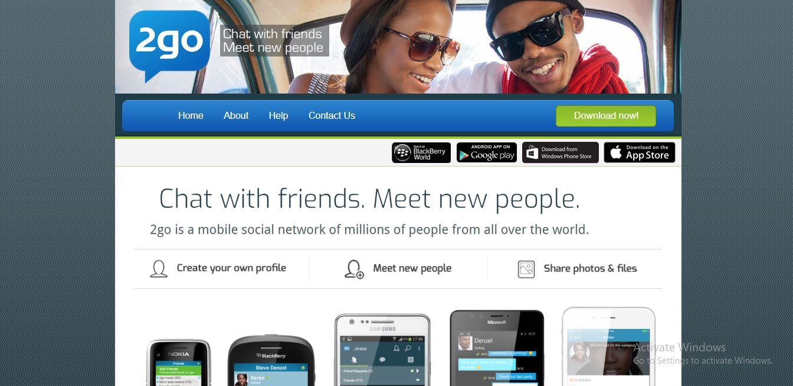

# 2go Landing page

Welcome to the README file for the 2go social media landing page! This document provides an overview of the landing page, its features, setup instructions, and guidelines for customization.

## Table of contents

-   [Overview](#overview)
    -   [The challenge](#the-challenge)
    -   [Screenshot](#screenshot)
    -   [Links](#links)
-   [My process](#my-process)
    -   [Built with](#built-with)
    -   [What I learned](#what-i-learned)
    -   [Continued development](#continued-development)
-   [Author](#author)
-   [Clone the Repository](#Clone-the-Repository)
-   [Contributing](#Contributing)
-   [Conclusion](#Conclusion)

## Overview

### The challenge

Users should be able to:

-   View the optimal layout for the site depending on their device's screen size

### Screenshot

### Links

-   Live Site URL: [Live site URL here]()

## My process

### Built with

-   Semantic HTML5 markup
-   CSS custom properties
-   Flexbox
-   CSS Grid
-   Desktop-first workflow

### What I learned

-   I learned to use HTML 5 Semantic markup, such as using <header>, <nav>, <main>, <section>, and <footer> tags, will help you organize content effectively.
-   I learned to use Techniques like CSS selectors, box model, and flexbox layouts can be utilized to create an appealing and responsive design.

### Continued development

-   I would learn how to become proficient in applying CSS styles to enhance the visual appearance of the landing page.
-   I would learn how to make a website responsive, ensuring it adapts well to different screen sizes and devices.
-   I would learn how Techniques like media queries, fluid grids, and responsive images can be employed to achieve a responsive layout.

## Author

-   LinkedIn - [Ohani Kizito](https://www.your-site.com)
-   Twitter - [Ohani_Kizito](https://www.twitter.com/Ohani_Kizito)

## Clone the Repository

git clone https://github.com/kizitech/2go-Landing-Page.git

## Contributing

As this landing page is built with plain HTML and CSS, contributions may involve customization and enhancements specific to your needs. Therefore, there might not be a collaborative contribution process in the traditional sense. However, you are free to fork the repository, make modifications, and adapt it to suit your requirements.

## Conclusion

Thank you for using the 2go social media landing page template. We hope it effectively showcases your social media platform and attracts potential users. If you have any questions or need further assistance, please feel free to reach out. Happy customization!
